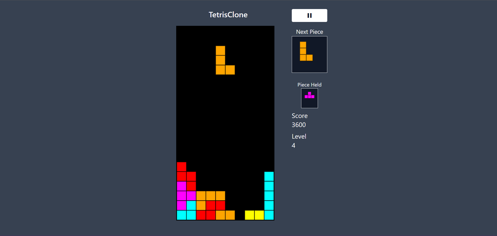

# 🕹️ Tetris Clone

[](https://vuejs.org/)
[](https://tetris-clone-jet.vercel.app/)

Este es un clon del clásico juego Tetris , desarrollado con Vue.js como parte de un proyecto personal para explorar conceptos de programación y desarrollo de videojuegos. El objetivo es recrear la experiencia clásica de Tetris con una implementación moderna y código limpio.

 

## 🚀 Características Principales
- **Jugabilidad clásica**: Incluye las mecánicas tradicionales de Tetris, como rotación de piezas, eliminación de líneas y puntuación.
- **Interfaz simple**: Diseño limpio y fácil de entender.
- **Puntuación y niveles**: Sistema de puntuación y aumento de dificultad a medida que avanzas.
- **Pausa y reinicio**: Funcionalidades básicas para pausar y reiniciar el juego.
- **Interfaz responsive**: Diseñado para funcionar en dispositivos móviles y escritorios.

## 🛠 Tecnologías Utilizadas
| Tecnología | Uso |
|------------|-----|
| Vue.js 3 | Framework principal |
| Vuex | Gestión de estado |
| Tailwind CSS | Estilos y diseño responsive |
| Vercel | Despliegue continuo |

## 🎮 Controles
#### **🖥️ En escritorio:**
- **Flecha derecha/izquierda**: Mover la pieza horizontalmente.
- **Flecha abajo**: Acelerar la caída de la pieza.
- **Flecha arriba**: Rotar pieza.
- **Espacio**: Dejar caer la pieza instantáneamente.
- **Enter**: Guardar la pieza actual.
- **Esc / P**: Pausar/Reanudar el juego.
  
#### **📱 En dispositivos móviles:**
- **Botones en pantalla:**: Controles táctiles para mover, rotar y dejar caer las piezas.
- **Toque a la pantalla**: Rotar pieza.
- **Deslizar abajo**: Dejar caer la pieza instantáneamente.

## 📦 Instalación Local
1. Clona el repositorio:
```bash
git clone https://github.com/jpundonor/tetris-clone.git
```
2. Instala dependencias:

```bash
npm install
```
3. Ejecuta el servidor de desarrollo:
```bash
npm run dev
```

## 🎯 Demo en Vivo

Accede a la versión desplegada:

[👉 Ver Proyecto en Vercel](https://tetris-clone-jet.vercel.app/)


## 🤝 Contribuciones

Las contribuciones son bienvenidas! Si tienes alguna idea para mejorar el juego, encuentras un error o quieres agregar nuevas características, no dudes en contribuir.

**Para contribuir:**

1. Haz un fork del repositorio.
2. Crea una nueva rama 
```bash
git checkout -b feature/nueva-caracteristica
```
3. Realiza tus cambios y confirma los commits 
```bash
git commit -m "Descripción del cambio"
```
4. Sube los cambios a tu fork 
```bash
git push origin feature/nueva-caracteristica
```
5. Abre un pull request para revisión.

#### Si tienes alguna duda, siéntete libre de abrir un issue.
### 

Hecho con ❤️ por [Javier Rojas](https://javier-rojas.vercel.app/)
